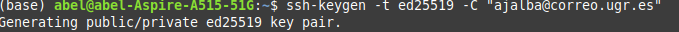
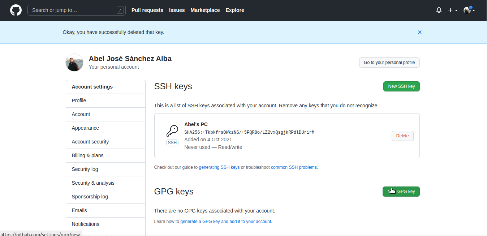
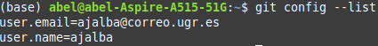
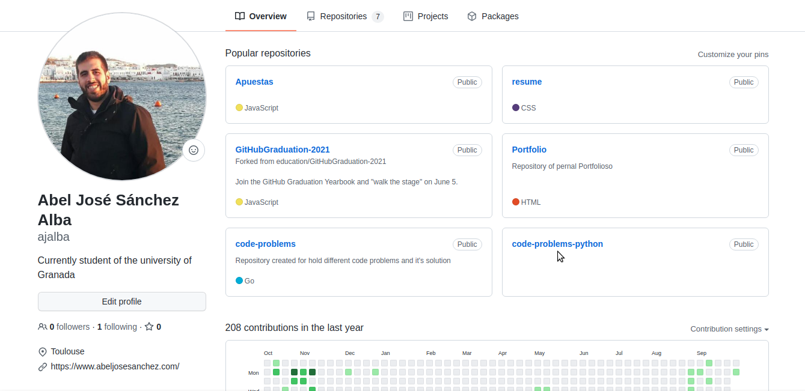
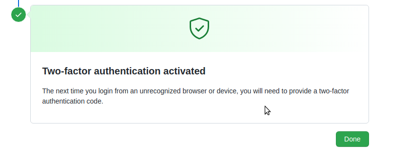
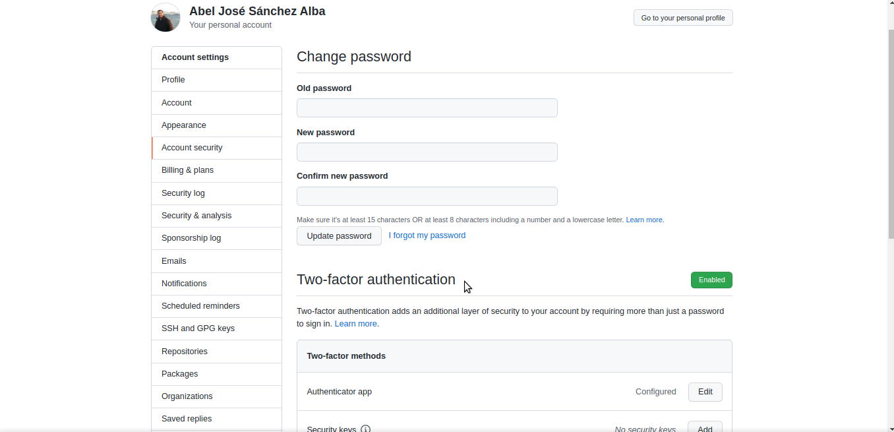

# Configuración inicial de git, entorno de desarrollo para el proyecto

A continuación se documenta la serie de pasos seguidos, desde cero para configurar el entorno de desarrollo del proyecto.

## Creación de par de claves y subida de clave pública a GitHub

Abrimos una terminal y ejecutamos el comando

```
ssh-keygen -t ed25519 -C "email@ejemplo.com"
```

Sustituyendo el email de ejemplo por el email que queremos que se emplee como etiqueta para crear el par de claves pública y privada. En mi caso el comando sería como en la imagen.



Se pregutará si se desea crear el par de claves en un directorio específico. Si no se selecciona directorio donde crear el par de claves, se toma un directorio por defecto, normalmente es **/home/username/.ssh**

Una vez hecho esto, es necesario añadir la clave al gestor ssh del entorno local, primero se inicia el agente SSH en segundo plano con el comando

```

eval "$(ssh-agent -s)"

```

Y luego se le añade la clave privada creada

```

ssh-add ~/.ssh/id_ed25519

```

Con esto hemos configurado el entorno local, ahora es necesario añadir la clave pública de nuestro par de claves a Github. Para ello, una vez hecho el login accedemos a la seccion de **configuración -> SSH and GPG Keys**. Una vez aquí es necesario , crear una nueva clave ssh, para ello es necesario asignarle un nombre y después añadir la clave pública, que se encuentra en **~/.ssh/id_ed25519.pub**

Una vez hecho esto, se tiene la clave ssh como se puede ver en la imagen



## Configuración correcta del nombre y correo electrónico para que aparezca en los commits.

Es sencillo configurar el nombre y correo electrónico mediante git congif de la siguiente forma, si no se va a usar otra identificación, como es mi caso, se configura de forma global.

```

git config --global user.name "nombreusuario"
git config --global user.email emailpersonal

```




## Edición del perfil de GitHub para que aparezca una imagen en vez del avatar por omisión, nombre completo y ciudad, así como universidad.

Basta con acceder a la sección de configuración de perfil dentro de guthub y añadir los datos necesarios.



## Incrementar la seguridad de nuestra cuenta en GitHub activando el segundo factor de autenticación.

Accedemos a la configuración de nuestra cuenta en github, allí navegamos hasta el apartado de segundo factor de autenticación. Se nos dan las opciones de emplear una app o autenticar via SMS, elegimos la opción de app, además es la recomendada por github.

En mi caso la aplicacion empleada para el segundo factor de autenticación será Microsoft Authenticator. Basta con escanear el código QR y seguir los pasos que ofrece github para completar la activación. Llegaremos a una pantalla final como esta



Si volvemos a acceder a la configuración de nuestra cuenta, aparecerá en la misma sección, la opción de __Autheticator app__ como configurada, como se puede ver en esta imagen.


